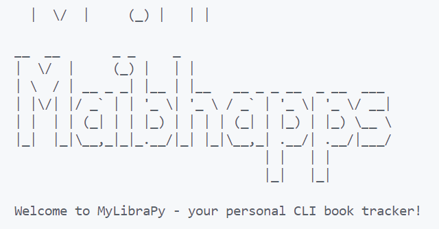
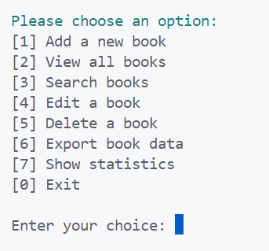
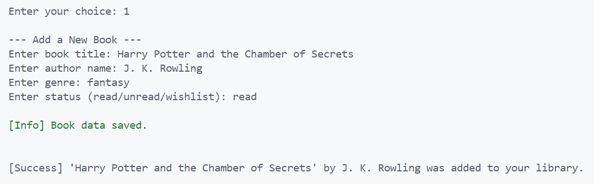
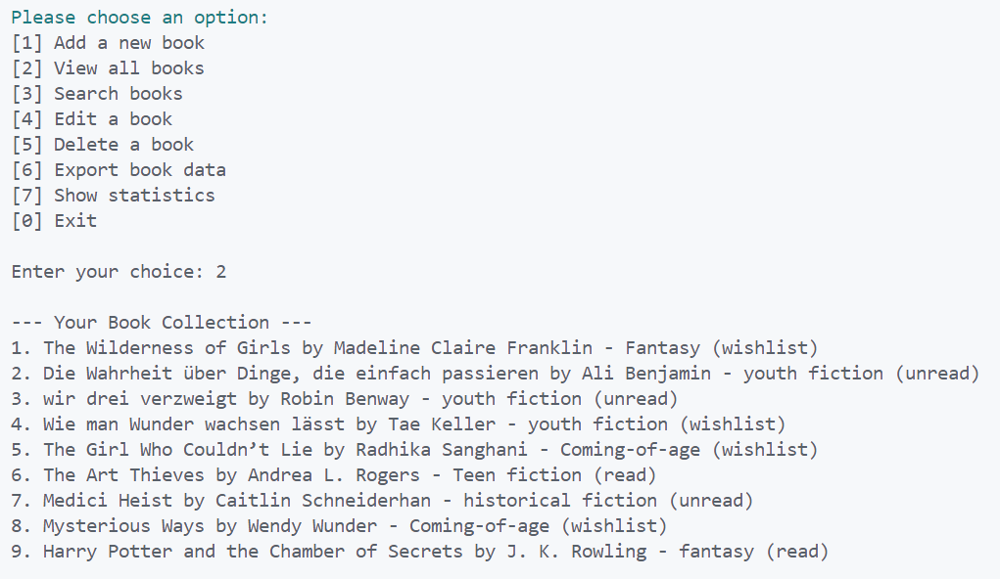
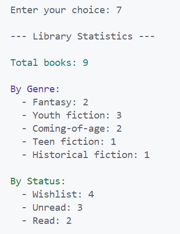
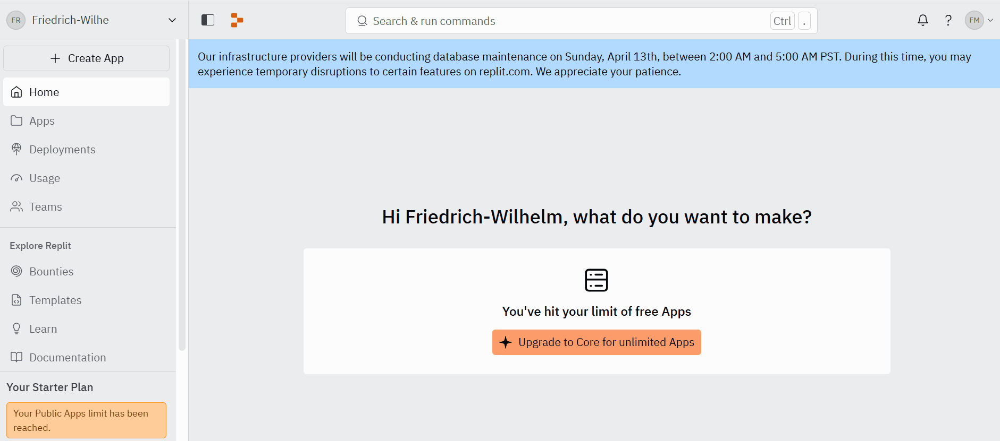

# MyLibraPy

```text

  __  __       _      _ _               _____       
 |  \/  |     | |    (_) |             |  __ \      
 | \  / |_   _| |     _| |__  _ __ __ _| |__) |   _ 
 | |\/| | | | | |    | | '_ \| '__/ _` |  ___/ | | |
 | |  | | |_| | |____| | |_) | | | (_| | |   | |_| |
 |_|  |_|\__, |______|_|_.__/|_|  \__,_|_|    \__, |
          __/ |                                __/ |
         |___/                                |___/ 

```

*A simple CLI library manager – built for learning, testing, and practical use in school settings.*

---
[](https://replit.com/@Friedrich-Wilhe/P3MyLibraPy)


## 🔒 Inspiration From the Classroom

As a teacher at the **European School Karlsruhe**, I constantly explore ways to blend code with everyday school experiences. One of the most practical and relatable topics? **Books.**

This small app grew out of that: a terminal-based tool to help track personal book collections. Students were curious about file handling, persistent data, and terminal UIs – so we started building something together. Not flashy. Not fancy. But it works, and it grows with us.

In parallel, we're also working on a bigger platform: a full-featured **BookExchange** app (database, GUI, server, the works). But **MyLibraPy** is where we try things out. A sandbox. A real-use example. A place where students, colleagues, and I can experiment with real code, for real use.

> “Sir, can we make it print in color?”  
> “Yes. And now we’re importing Colorama.”

This project became part lesson, part library.

---

## ✨ Features

### ✅ Implemented

- 📚 **Add Book**  
  Enter title, author, genre, and status (read/unread/wishlist) – saved to `books.json`.

- 👀 **View Books**  
  See all your books in a clear, numbered list.

- 🔍 **Search**  
  Search titles, authors, or genres with any keyword.

- ✏️ **Edit Book**  
  Select a book by number and change any field.

- ❌ **Delete Book**  
  Choose a book to delete (with confirmation).

- 📤 **Export to CSV**  
  Write all books to `books_export.csv` – spreadsheet-ready.

- 📊 **Statistics**  
  Get a breakdown by genre and status, with totals.

- 💾 **Persistent Storage**  
  Your collection is saved between sessions using JSON.

---

## 🖼️ Screenshots

A few glimpses of the interface in use:

- **Banner / Welcome**:  
  
- **Main Menu**:  
  

- **Add Book Dialog**:  
  

- **Book List View**:  
  

- **Library Statistics**:  
  

- **Full Workflow Preview (GIF)**:  
  

---

## 🧪 Manual Testing

All functions were tested in:

- ✅ Windows Terminal (PowerShell & CMD)
- ✅ VS Code terminal

### Covered Scenarios:
- Adding new books
- Editing book details
- Deleting entries
- Searching (case-insensitive)
- JSON storage & reload after restart
- CSV export and file verification

### Code Quality:
- Linted using `pylint`
- Formatted with `black`

---

## 🐛 Known Issues

- No dropdowns or fixed status choices (user can mistype)
- Genre & status inputs are free text
- No duplication checks yet

---

## 🚀 How to Run Locally

1. Clone this repository:
   ```bash
   git clone https://github.com/freewimoe/P3_MyLibraPy.git
   cd P3_MyLibraPy
   ```

2. (Optional) Create a virtual environment:
   ```bash
   python -m venv venv
   venv\Scripts\activate  # Windows
   source venv/bin/activate  # macOS/Linux
   ```

3. Install the required package:
   ```bash
   pip install -r requirements.txt
   ```

4. Launch the app:
   ```bash
   python main.py
   ```

---

## 🚫 Why Gitpod is Not Used

Although Gitpod is normally a recommended platform by the Code Institute,  
this project is a **command-line (CLI)** Python application and does not require a web server.

Additionally, Gitpod now requires a **dedicated AWS Runner setup**, which is not accessible without an AWS account and permissions.

Therefore, this project uses [Replit](https://replit.com) for browser-based deployment and testing, which is more suited for CLI projects like this one.

→ See next section [How to Run on Replit](#🌐-how-to-run-on-replit) above.


## 🌐 How to Run on Replit (Recommended)
> ⚠️ **Note:** Since this is a CLI app (not a web app), Replit will not open a browser preview.
> Instead, you must **switch to the "Console" tab** after pressing the green **"Run"** button.


You can run this app entirely in the browser using [Replit](https://replit.com) – no installation required.

💡 Need a preview?
Check out this GIF of the full workflow.

### ✅ Steps to run:

1. Go to the Replit project page:  
   👉 [https://replit.com/@Friedrich-Wilhe/P3MyLibraPy](https://replit.com/@Friedrich-Wilhe/P3MyLibraPy)

2. Log in with a free Replit account (if you're not logged in already).

3. Click the **"Remix this app"** button.  
   This will create your own copy of the project with full access.

4. In your remix:
   - Click the green **“Run”** button at the top.
   - Then **switch to the "Console" tab** (below or next to the output window)  
     → This is where the app runs and shows its CLI menu.

5. Use your keyboard to interact with the app  
   (e.g., type `1` and press Enter to add a book).

### ℹ️ Note:

If the app doesn't start automatically after clicking Run, make sure the file `.replit` contains the following:

```ini
language = "python3"
run = "python3 main.py"
```

## 📦 Dependencies

```
colorama==0.4.6
```

---

## 🔮 What’s Next?

- Full GUI (Tkinter or PyQt)
- Multi-user mode with login
- Ratings & personal reviews
- Cloud sync (e.g. Firebase or Supabase)

---

## 🙏 Thanks & Credits

- My **students** at the European School Karlsruhe
- The **Code Institute** for the structured challenge
- [Colorama](https://github.com/tartley/colorama) for terminal color magic
- My mentor **Mo Shami** for valuable guidance
- **Kay Welfare**, my cohort facilitator, for ongoing support

---

## 🔗 Repository

👉 [github.com/freewimoe/P3_MyLibraPy](https://github.com/freewimoe/P3_MyLibraPy)

If you're a teacher, student, or just a curious coder – I hope MyLibraPy inspires you like it inspired us in class. 📚✨
